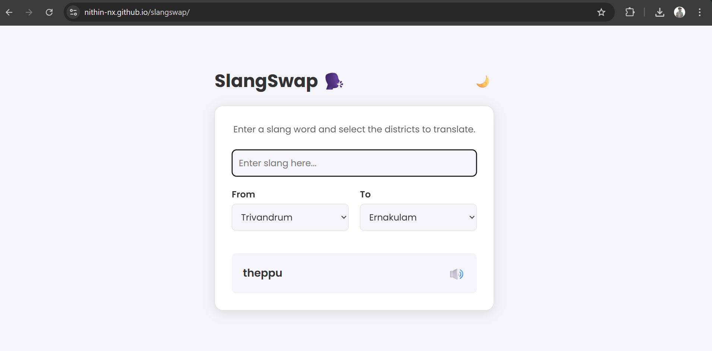
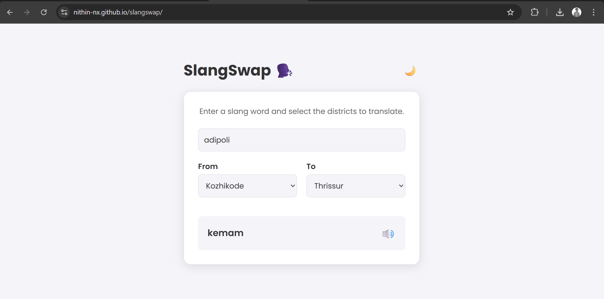
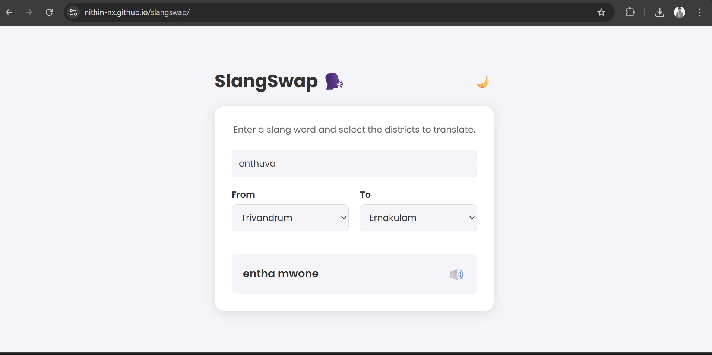

# SLANG SWAP 🎯

## Basic Details
### Team Name: N²

### Team Members
- Team Lead:Nithin N - Goverment Engineering College Idukki
- Member 2:Nidhin Gireesh - Goverment Engineering College Idukki

### Project Description
SlangSwap – A fun web app that translates slang words from one Kerala district into the slang of all other districts, complete with pronunciation and examples.
Currently, the database contains only a small set of slang words for demo purposes — but it can be expanded in the future to include hundreds more.
You can check these database entries for testing and verification during development.
## Link 
https://nithin-nx.github.io/slangtrans/

### The Problem (that doesn't exist)
Keralites love their slang, but sometimes slang from one district sounds like alien language to another district.

### The Solution (that nobody asked for)
A slang translator that instantly converts your local slang into equivalent slang from  other Kerala district — because why not? 😄
##✨ Key Features
District-to-District Translation: Translate slang from one Kerala district to all others.

Text-to-Speech (TTS): Hear the correct pronunciation of each slang word with a click.

Fun Audio Cues: Get confirmation with "Machane kitty!" on success and "Illada aliya!" on failure.

Dark Mode: A sleek dark mode for comfortable night-time slang swapping.

Simple & Fast: Built with pure, vanilla JavaScript for a lightweight and speedy experience.

Expandable JSON Database: Powered by a simple JSON file that can be easily updated with new slang.

## Technical Details
### Technologies/Components Used
For Software:

Languages used: HTML, CSS, JavaScript

Frameworks used: None (pure vanilla JS for simplicity)

Libraries used:

Howler.js (for audio playback)

Simple JSON database (slang data)

Tools used: VS Code, GitHub Pages

For Hardware: (Not applicable – software only)
### Implementation
For Software:
# Installation
git clone https://github.com/your-username/slangswap.git
cd slangswap

# Run
Simply open index.html in your browser.

### Project Documentation
For Software:

📸 Screenshots & Demo
Light Mode	Dark Mode
SlangSwap homepage with input box and district selection
Slang translation results showing equivalent slang in other district.

Audio pronunciation button next to each slang word.

Export to Sheets
🎥 Video Demo
Check out the screen recording below to see SlangSwap in action!

 <a href="ScreenRecording.mp4">Watch the Demo Video</a>

## Team Contributions
- Nithin N :App design, frontend coding, slang database creation.
- Nidhin Gireesh:Testing,deployed app to GitHub Pages.

---
Made with ❤️ at TinkerHub Useless Projects 

